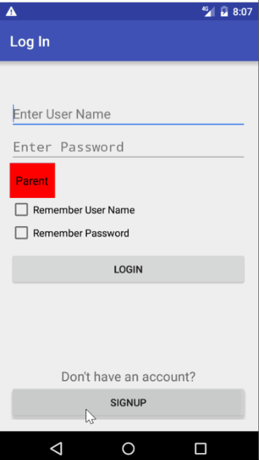
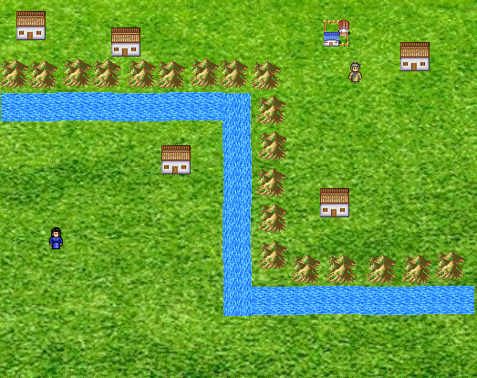
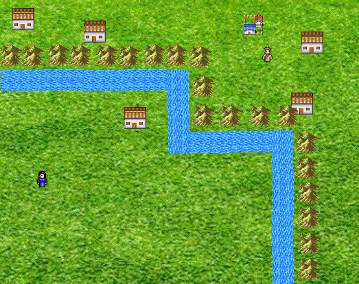
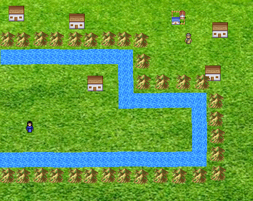

#  Welcome to Kid Logic Learning Game App- Android App
* This project was to a game app to let little kids learn logics.
* There are three levels and each level has time limiation.
* Users can register as roles of parent or kid. For kid role, it shows game after logging in. For parent role, it shows game report for kids after logging in. 
* There is background music playing during game. Users can choose to play or mute the music.
* There is drag and drop features to make the game easy to play.
* There is animation after users input the correct answer.

#  Final Demo:
_It may takes time to load the gif. Please wait._

_Refresh the page to replay the gif._

_Click on picture to watch video._

##  Details:

####  Game Levels:
######  This game contains three levels:

